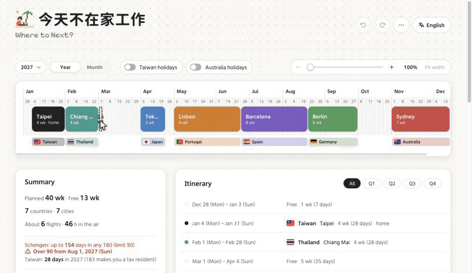
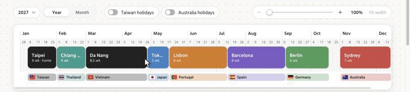
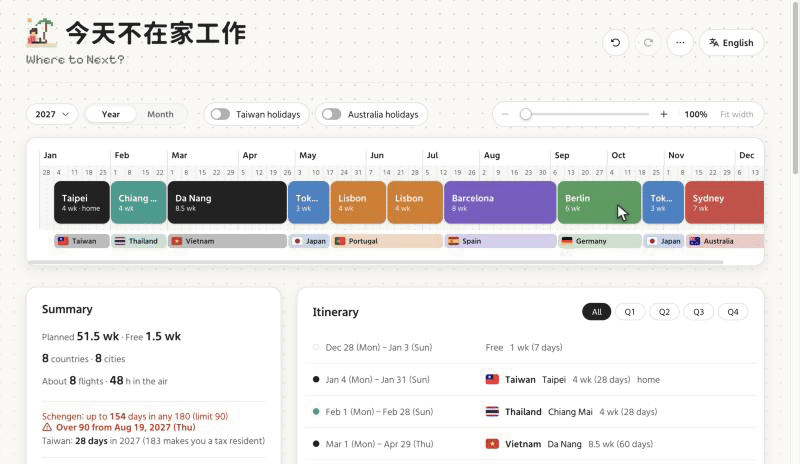
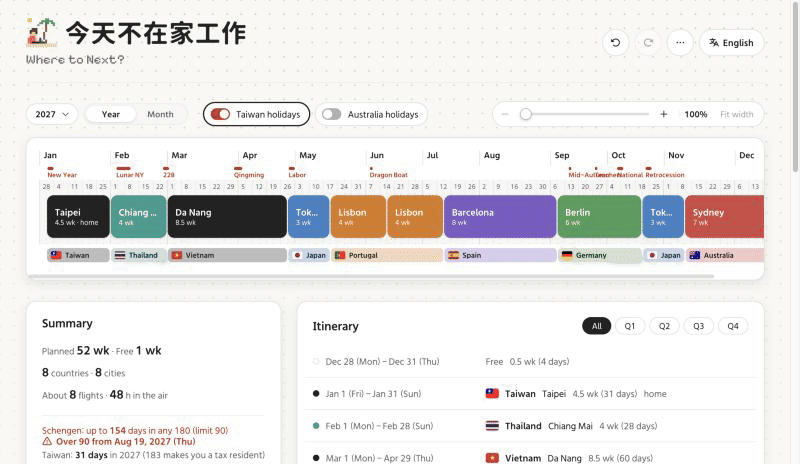

# Not WFH

**A Digital Nomad Planner** — 今天不在家工作 in Chinese, 今日は在宅じゃない in Japanese: the same joke in three languages. The interface shows whichever name matches its language.

[繁體中文](README.md) · **English**

A single-page planner for a year of digital nomading. The year is laid out as 53 weeks; drag across them to block out which city you'll be in and when. Your data stays in your browser — no account, no backend.

**Live: <https://simonlin7972.github.io/digital-nomad-planner/app/>** (landing page: <https://simonlin7972.github.io/digital-nomad-planner/>)


The interface is available in Traditional Chinese, English and Japanese; choose on the settings page.

---

## Contents

- [Features](#features)
- [Getting started](#getting-started)
- [Controls](#controls)
- [Data and privacy](#data-and-privacy)
- [Data format](#data-format)
- [Project structure](#project-structure)
- [Design notes](#design-notes)
- [Known limits](#known-limits)
- [Possible next steps](#possible-next-steps)
- [Third-party resources](#third-party-resources)
- [Contributing](#contributing)
- [License](#license)

---

## Features

### Year view (timeline)

- One horizontal timeline of a whole year (53 weeks in 2027), one cell per week, each split into two half-weeks; zoomed to 300% or more it works by the day
- Drag across empty cells → enter a country and city → a stay appears
- Dragging a whole stay **reorders** it: once it is halfway past a neighbour the two swap, and so on down the line
- Dragging a stay's edge **resizes and pushes**: growing shoves neighbours along, using up gaps first
- Holding `Alt` (`⌥` on a Mac) while dragging **duplicates**: the original stays put and a copy is inserted where you let go and the stays after it shift later (nothing before it moves)
- Holding `B` and clicking a stay **cuts** it: the pointer turns to scissors with a line showing the cut, and a click splits the stay in two there (the second part has no flight)
- A strip under each stay shows its country (flag and name); back-to-back stays in the same country share one strip
- Zoom from 100% to 600% with the slider, a trackpad pinch, two-finger touch, or `Ctrl`/`Alt` + wheel, always centred on the pointer
- Drag the month row to pan; click a month to open it in the month view





### Month view (calendar)

- A seven-column calendar, precise to the **day**
- Drag across days to add a stay; drag a bar's ends to change its dates; click a bar to edit it; hold `B` and click a bar to cut it in two
- The header shows how many days of the month are planned and free
- The "All months" switch beside the tabs stacks January to December down one long page to scroll through; every month can still be dragged and edited; once scrolled down, a button in the bottom-right corner goes back to the top



### What a stay records

- Country and city (at least one). Both are picked from searchable lists, in any of the three languages:
  - Countries: about 260, also searchable by ISO code or common alias (`thai`, `jp`, `韓國`)
  - Cities: about 330 common ones built in. With a country chosen only its cities are listed; picking a city with no country fills the country in. Cities not on the list can simply be typed
- Exact start and end dates
- Color (black plus 8 others; a new place starts black, a place you've used before keeps its color)
- Who you're travelling with
- Flight booked: airline, flight number, departure time, booking reference, fare. The airline is picked from a searchable list of about 75 common airlines, each with its logo (by Chinese or English name or two-letter code, or typed freely); the flight number picker offers that airline's code and flight numbers already in the plan
- A note

### Overview

- **Summary**: weeks planned and free, countries and cities visited, an estimate of flights and hours in the air, and weeks and days per country and city
- **Days of stay**: the summary works out the most days spent in the Schengen area within any 180 days (the limit is 90; when exceeded it says from which date), and the days planned in your tax-residence country that year (Taiwan unless changed in settings; 183 days is the usual tax-residency line). Only days on the timeline are counted
- **Itinerary**: one line per stay — dates, flag and country, city, weeks (days), companions, note; filter by Q1–Q4; stays with a flight show a ticket icon; stays that overrun the Schengen limit show a warning icon
- **Seasons**: about 71 popular nomad bases (Chiang Mai, Bali, Lisbon, Mexico City…) carry a best / fine / avoid rating for each month, with reasons. The editor has a "When to go" button that opens the twelve months and reasons (it flags a poor season even when closed); stays that land in months to avoid (Chiang Mai's burning season in March–April, Dubai's summer) get a warning on the block, in the itinerary and on the hover card
- **Free stretches**: unplanned days between stays are listed in the itinerary too; press `+` to add a stay in that gap
- **Map**: every place in visit order, joined into a route
- **Year**: the drop-down beside the view tabs switches between 2025, 2026, 2027 and 2028; each year keeps its own plan. Dragging the month row past December (or January) and letting go moves to the next (or previous) year
- **Public holidays**: toggle Taiwan's and Australia's 2026 and 2027 holidays, drawn over the timeline and calendar (no holiday data for 2028 yet)



### Also

- A built-in "How to use" guide in sections that open and close: gestures, where data lives, backup and transfer
- Traditional Chinese, English and Japanese interface, chosen on the settings page (the landing and changelog pages can switch it from their headers too); defaults to the browser's language and remembers your choice
- A compact toolbar: undo and redo are icons; export, import and Share live in the `⋯` menu, with "How to use", "About this app" (opens the landing page in a new tab) and "Report a problem or suggest" (a title, a description, up to 3 screenshots and an optional email, sent straight to the developer) below a divider
- A footer at the bottom of the page: where the data lives, the licence, and links home and to the changelog
- A changelog page (/changelog/): new features and changes in every release, newest day first, in the interface language (English when the interface is Japanese). It is built from `CHANGELOG.md` at the repository root, so updating that file and pushing publishes it
- A Profile & settings page (/profile/, from the person icon at the right end of the toolbar; once a character is saved, the button shows its face):
  - My character: a front-facing pixel paper doll. Pick one of 10 ready-made nomads (engineer, designer, surfer, backpacker…) or put one together from skin tone, hair, top, bottom and shoes, plus separate slots for the head, eyes, mouth and cheeks, neck, back, each hand and each side (hats, a conical hat, bunny ears, glasses, an eye patch, a beard, a face mask, a scarf, a neck pillow, bags, a guitar, a skateboard, a cape, bubble tea, an umbrella, a suitcase, a surfboard, a tent, a cat, dog or rabbit…); or roll a random one. Pointing at a choice previews it; this one is saved with its own Save button, and leaving without saving drops the changes. Once saved, it appears on the toolbar's settings button and on the shared image
  - About me: a nickname (shown on the shared image), home (the flight estimate adds the trips from and back home), passport (an EU, EEA or Swiss passport hides the Schengen 90/180 count) and tax residence (the country whose 183 days are counted; Taiwan by default, empty to hide)
  - Display: language, public holiday switches, temperature unit (°C / °F)
  - Data: how long before the backup reminder (3 / 7 / 14 days, or off)
  - About: the last update date and links home and to the changelog
  - Everything but the character saves at once; it all stays in this browser and is not part of exports
- Undo and redo, up to 100 steps
- JSON export and import: one file holds every year; file names carry the export date (e.g. `nomad-plan_2026-10-06.json`). On a computer you can also drop the file onto the page to import it
- Send to another device: the `⋯` menu makes a link and a QR code carrying every year's plan; opening it on another computer or phone imports it there (asking first before replacing years already planned), and pasting it into a tab that already has the planner open works too. The plan is compressed into the part of the address after `#` and never passes through a server; booking references and fares can be left out
- Share: preview your plan as an image, then download it as a PNG, in two layouts — landscape (fixed size, with the timeline, country strips and flags, holidays that are switched on, ticket markers, a summary line and the itinerary) and portrait 9:16 (for stories: summary, twelve month bars and the itinerary, ending in "N more" when it runs out of room); a saved character is drawn to the right of the title; flight details left out of both. Landscape is the default on a computer, portrait on a phone, where it can also open the system share sheet
- Read-only phone layout: below 720px (or on a phone held sideways) the page becomes view-only — a one-row header; at the top, "now" (dates, progress, days left) and "next" (days until you leave, with the flight right there if you have one), found across years; below, one card per stay (flight details and full notes included), with past stays folded into one line you can open; then the summary and the map. It opens on the current year. Stay cards let you copy the flight number and booking reference, add the departure to your calendar (.ics), and open the place in Google Maps. Menus and dialogs rise from the bottom of the screen, and the guide shows only the parts that apply on a phone. Plan on a computer, then use "Send to another device" and scan the QR code, or export a file and import it on the phone
- Installable and usable offline: a service worker keeps the files and fonts the page has loaded, so it opens without a connection (the map aside)
- Every change is saved automatically
- Backup reminder: when the plan has changed and gone 7 days without an export, a reminder appears under the header, with buttons to export or to put it off for 3 days
- Landing page (the site root; the app is at `/app/`): introduces the features, each with a short animation that plays when scrolled into view (drag-select, cut, month view, map route, Schengen and Taiwan day counts, seasons, share image, and a tablet frame showing the desktop app switch from year to month view, then shrinking into the phone layout). The demos are simplified HTML/CSS redraws and never read your plan

---

## Getting started

Requires Node.js 22 or later.

```bash
git clone https://github.com/Simonlin7972/digital-nomad-planner.git
cd digital-nomad-planner
npm install
npm run dev
```

Open http://localhost:5173/app/ (the root, http://localhost:5173, is the landing page).

| Command | What it does |
| --- | --- |
| `npm run dev` | Start the dev server (fixed to port 5173) |
| `npm run build` | Type-check, then bundle into `dist/` |
| `npm run preview` | Serve the built bundle locally |

The build is plain static files and can be hosted anywhere. Asset paths are relative (`base: './'` in `vite.config.ts`), so it also works from a sub-path.

There are no automated tests and no linter. The `tsc --noEmit` inside `npm run build` is the only check.

### Deploying

Pushing to `main` builds and publishes to GitHub Pages through GitHub Actions (`.github/workflows/deploy.yml`). To deploy a fork, go to the repository's Settings → Pages and set Source to **GitHub Actions**.

The root is the landing page and the app lives at `/app/`; each page's `og:url` holds its own absolute GitHub Pages address. Bookmarks of the old address (the root) now land on the landing page first; plans are in `localStorage` for the whole domain, so moving to `/app/` keeps them.

The live site and a local copy use separate browser storage (different addresses), so they don't share data. Use export and import to move a plan between them.

---

## Controls

### Mouse and touch

| Action | Year view | Month view |
| --- | --- | --- |
| Drag across empty space | Select in half-weeks (in days at 300% zoom and above); add a stay | Select in days; add a stay |
| Click a stay | Open the editor | Open the editor |
| Drag a stay | Reorder | — (not supported) |
| `Alt` + drag a stay | Drop a copy where you let go | — (not supported) |
| Hold `B` + click a stay | Cut it in two at the line | Cut it in two at the line |
| Drag a stay's edge | Resize, pushing neighbours | Resize, pushing neighbours |
| Hover a stay | Show its details | Show its details |
| Drag the month row | Pan the timeline | — |
| Drag the month row past the start or end of the year and let go | Move to the previous or next year | — |
| Click a month | Open that month | — |
| Pinch / `Ctrl`+wheel / `Alt`+wheel | Zoom the timeline | — |

### Keyboard

| Shortcut | Action |
| --- | --- |
| `⌘Z` / `Ctrl+Z` | Undo |
| `⌘⇧Z` / `Ctrl+Shift+Z` / `Ctrl+Y` | Redo |
| `Esc` | Close the editor |
| `Enter` (in the editor) | Save |

Undo and redo shortcuts are left alone while you are typing in a field, while the editor is open, or mid-drag.

---

## Data and privacy

**Your plan is never uploaded to a server.** Everything is kept in the browser's `localStorage`:

| Key | Contents |
| --- | --- |
| `dnp-plan-2026`, `dnp-plan-2027`, `dnp-plan-2028` | The plan for each year |
| `dnp-year` | The year being planned |
| `dnp-profile` | The settings page's character, "about me", temperature unit and backup reminder interval |
| `dnp-geocode` | Cached coordinates for place names |
| `dnp-zoom` | Timeline zoom level |
| `dnp-view` | Current view (year or month) and month |
| `dnp-holidays` | Which holiday sets are on |
| `dnp-lang` | Interface language |
| `dnp-ga-activated`, `dnp-ga-internal` | Analytics only: whether the "first stay created" event has been sent; whether this browser is marked as the owner's (`?internal=1` in the address) |
| `dnp-backup`, `dnp-backup-<year>` | Time of the last export (or import) and a fingerprint of the plan, used to decide when to show the backup reminder; 2027 uses `dnp-backup`, other years one each |

Clearing browser data, or using a different browser or computer, means the plan won't be there. Use Export (in the `⋯` menu) to keep a backup.

The page talks to these outside services:

| Service | What is sent | Why |
| --- | --- | --- |
| [Nominatim](https://nominatim.openstreetmap.org/) (OpenStreetMap) | The "city, country" text for each place | To find coordinates for the map and the flight estimate. Each place is looked up once |
| [OpenFreeMap](https://openfreemap.org/) | Map tile requests | The base map |
| [emfont](https://font.emtech.cc/) | Font file requests | The interface typeface |
| [Google Fonts](https://fonts.google.com/) | Font file requests | The pixel typefaces of the tagline under the title (English, Japanese); the Chinese one ships with the site, no extra request |
| [Google Maps](https://www.google.com/maps) | When you tap the map pin on a phone card, that stay's "city, country" | Opens the place in Google Maps; nothing is sent unless you tap |
| [FormSubmit](https://formsubmit.co/) | Only when you send "Report a problem or suggest": the title, description and screenshots you add (scaled down to JPEG), the optional email, and the page, language, year, window size and browser | Delivers the report to the developer's inbox; **nothing from your plan is sent** |
| [Google Analytics](https://analytics.google.com/) (GA4) | Anonymous usage such as page views, scrolling and outbound clicks; events for actions such as opening the planner, adding a stay, exporting, importing and sharing, carrying only interface choices and bucketed counts (e.g. "2–5 stays"); plus browser, device and rough location; sets a `_ga` cookie | Traffic and feature-use figures; the event list is in [ANALYTICS.md](ANALYTICS.md). Loaded on the live site only, not under `npm run dev`; **nothing from your plan is sent** |

Flight details such as booking references are stored in `localStorage` and are written into exported JSON. Keep that in mind before sharing an export.

A "Send to another device" link carries the plan in the part of the address after `#`: browsers never send that part to the server, so the site itself never receives it, and the page removes it from the address before analytics loads. But the link is the plan: anyone who has it can read it, and sending it by chat or email leaves a copy with those services. The QR code is drawn in the browser without calling any service.

The offline service worker (`sw.js`) keeps only this site's files and those from the two font services above, in the browser's Cache Storage (`dnp-v1`), and sends nothing extra.

---

## Data format

An exported file holds every year that has stays, each in the same form:

```jsonc
{
  "version": 2,
  "years": {
    "2026": { "year": 2026, "stays": [ … ] },
    "2027": { "year": 2027, "stays": [ … ] }
  }
}
```

Each year:

```jsonc
{
  "year": 2027,
  "stays": [
    {
      "id": "0b7c…",              // generated on import if left out
      "country": "th",            // see below; may be empty, but not together with city
      "city": "Chiang Mai",
      "start": "2027-02-10",      // ISO date
      "end": "2027-03-07",        // inclusive; must be >= start
      "color": "teal",            // optional: black red orange yellow green teal blue purple pink
      "companions": "Amy",        // optional
      "ticket": {                 // optional; its presence means "flight booked", every field optional
        "airline": "EVA Air",
        "flightNo": "BR211",
        "departure": "2027-02-10T08:30",
        "bookingRef": "ABC123",
        "price": "NT$ 8,500"
      },
      "note": "Yi Peng festival"  // optional
    }
  ]
}
```

**Country and city are stored in a language-neutral form** and turned into names for display:

| Field | On the list | Not on the list |
| --- | --- | --- |
| `country` | Lower-case ISO code (`th`, `jp`), or a region id (`europe`, `southeast-asia`, `south-america`, …) | The text you typed, kept as is |
| `city` | The city's English name (`Chiang Mai`) | The text you typed, kept as is |

Names are accepted on import too: `"country": "泰國"`, `"Thailand"` and `"city": "清邁"` are all recognised and converted to the form above.

Imports are sanitised (`sanitize`): entries that are malformed, out of range, or that overlap an earlier entry are skipped rather than failing the whole file.

Dates can range over the full weeks of the year's timeline: from the Monday of the week containing 1 January to the Sunday of the week containing 31 December. For 2027 that is 2026-12-28 to 2028-01-02 (53 weeks). On import each year is sanitised against its own range, and stays outside it are skipped.

Import rules: each year in the file **replaces** that year's current stays, and years not in the file are left alone; if any year being replaced already has stays, you are asked first, with the years listed. An older single-year file (`{ "year", "stays" }` at the top level) goes back to the year it names, or 2027 if it names none. Importing into the year on screen can be undone; other years are written directly and are not in the undo history. If the file has nothing for the year on screen, the page switches to the first year it brought in.

Older formats still load: week-based `startWeek`/`endWeek`, a single `location` field (treated as the city), and countries and cities stored by name rather than code.

A "Send to another device" link is `…/app/#plan=<code>`. The code's first character is `z` (followed by JSON compressed with deflate-raw, in base64url) or `j` (uncompressed JSON in base64url, for browsers without CompressionStream). The JSON is packed tighter than an export file so a whole plan fits in one QR code: `{ "v": 3, "y": { "<year>": [stays…] } }`, each stay an array `[days since the previous stay ended, length in days, country, city, color, companions, note, ticket]` (dates counted from 1 January of that year, the ticket as `[airline, flightNo, departure, bookingRef, price]`, empty trailing values dropped), with no ids (an import makes new ones). A year of 20 stays with notes and flights comes to about 700 characters; four years, 100 stays, about 2,400. It holds the same as an export file (minus `bookingRef` and `price` when flight details are left out) and imports by the same rules, except that it doesn't count as a backup, so the backup reminder isn't reset.

---

## Project structure

```
index.html              Landing page entry (the site root)
app/index.html          App entry (/app/); loads the font and favicon
changelog/index.html    Changelog page entry (/changelog/)
profile/index.html      Settings page entry (/profile/)
design/index.html       Design system page entry (/design/; served by `npm run dev` only, not built)
CHANGELOG.md            The user-facing release notes, source of the changelog page (format in the file's header comment)
public/favicon.svg      16×16 pixel-art globe
public/apple-touch-icon.png, icon-192.png, icon-512.png  Home-screen icons (the favicon scaled up with a margin)
public/manifest.webmanifest  PWA settings: name, icons, opens at /app/
public/sw.js            Offline service worker (keeps loaded files)
public/og.png           Link-preview image (1200×630, marks all three languages)
public/airlines/        Airline logos (<code>.png), downloaded once by scripts/fetch-airline-logos.mjs
scripts/subset-tagline-font.mjs  Cuts the characters of the Chinese tagline out of Cubic 11; re-run after changing the Chinese tagline
src/assets/              The subset tagline font file
scripts/fetch-airline-logos.mjs  Downloads a logo for every airline in airlines.ts; rerun after adding airlines
docs/overview.png       Sample image for the README (downloaded from the app's Share dialog)
docs/demo-*.gif         Feature demos for the README (English interface, sample data)
src/
  main.tsx              React mount point; sets the stylesheet order
  changelog/            The changelog page (renders CHANGELOG.md as parsed by `lib/changelog.ts`)
  profile/              The settings page (AvatarPicker is the character picker)
  design/               Design system page: colour, type, spacing, layout, radius and shadow, plus every state of the buttons, toggles, tabs, dropdowns, inputs and other base components; uses the app's own CSS, and forceStates copies :hover / :focus / :active rules to classes so states sit side by side
  landing/              Landing page: Landing (layout), Demos (scripted feature demos), motion (scroll triggers and looping)
  App.tsx               Wires the pieces together; owns the plan and page-level state
  components/           UI components, each with its stylesheet (.css) beside it
    Toolbar             Header actions and the ⋯ menu (export, import, send to another device, share, how to use, about, report a problem)
    Footer              Page footer: where data lives, licence, links home and to the changelog
    ViewBar             Year/month switch, holiday toggles, zoom
    YearView            The year timeline, including drag, resize and copy handling
    MonthView           The month calendar
    AllMonths           The month view's "All months": twelve stacked months and the back-to-top button
    Summary             Summary panel (including Schengen and Taiwan day counts)
    StayList            Itinerary, free-stretch rows and quarter filter
    BackupReminder      Backup reminder under the header
    Editor              Dialog for adding and editing a stay
    HelpDialog          The "How to use" guide
    YearSelect          The year drop-down
    SeasonStrip         The twelve-month season strip in the editor
    ShareDialog         Share: landscape / portrait PNG preview, download, system share sheet
    TransferDialog      Send to another device: link, QR code, flight-details switch
    ReportDialog        Report a problem or suggest: title, description, screenshots, contact email
    QrCode              The QR card: square modules, rounded finder eyes, the pixel mascot on its top edge
    MobileItinerary     The read-only phone itinerary (now / next, stay cards)
    HoverCards          Floating cards for stays, tickets and holidays
    Combobox            Searchable country and city pickers
    DatePicker          Custom date picker (instead of the browser's)
    MapView             Map (lazy-loaded)
    Flag                Country flag
    PixelNomad          The pixel-art animation in the header (someone on a laptop under a palm tree)
    Avatar              The paper-doll character (SVG, blinks; the large one on the settings page also bobs, with its pets moving)
    Tagline             The typewriter tagline under the title
    Dialog.css          Shell shared by the editor and help dialogs
  hooks/
    useHistory          Undo/redo stack
    useZoom             Timeline zoom and its anchor point
    usePinchZoom        Trackpad, touch and wheel zoom gestures
    useCoords           Place coordinates, distances and the flight estimate
    useScrollLock       Stops the page scrolling behind a dialog
    useNarrow           Whether to use the read-only phone layout (720px or narrower, or a touch screen 500px or less tall)
    useNearView         Whether an element has been scrolled near the viewport (loads the map late)
    useBackupReminder   Tracks time since the last export and decides whether to remind
  lib/                  Logic and data that isn't UI
    weeks.ts            Date model: weeks, day indexes, half-week slots, month ranges, labels
    storage.ts          Types, load/save, import sanitising, reorder/push/insert algorithms, colors
    prefs.ts            View, holiday toggles and zoom preferences
    stayRules.ts        Free stretches, Schengen 90/180 and the tax-residence 183 days
    seasons.ts          Season data for popular cities (monthly ratings and reasons) and the warning rule
    backup.ts           Backup reminder state and rules
    analytics.ts        Google Analytics: loading and track() events (live site only)
    changelog.ts        Parses CHANGELOG.md into dated, bilingual entries
    flags.ts            Country list, search, name → ISO code
    cities.ts           Built-in city list (Chinese and English) and search
    airlines.ts         Built-in list of common airlines (code, Chinese and English names, home country) and search
    holidays.ts         2026 and 2027 public holiday data
    geocode.ts          Nominatim lookups, rate limiting, cache
    exportPng.ts        Draws the PNG on a canvas (landscape and portrait)
    files.ts            File names and download
    transfer.ts         Transfer links: compress and encode, decode, take from the address
    ics.ts              Calendar file (.ics) for a flight
    offline.ts          Registers the service worker (live site only)
    links.ts            Links between the pages (home, planner, changelog, settings)
    report.ts           Problem reports: shrink screenshots, send by e-mail through FormSubmit
    avatar.ts           The paper doll: each part's pixel art, colours, ready-made characters, composing a 32×32 image
    profile.ts          Settings (character, nickname, home, passport, tax residence, temperature unit, backup reminder) and whether the Schengen rule applies
    util.ts             Small helpers
    i18n.tsx            Dictionaries, current locale, `t()`
  styles/base.css       Design tokens, page background, shared buttons and panels
README.md               Chinese README
README.en.md            This file; kept in step with README.md
MVP.md                  Product spec and decision log (Chinese)
CLAUDE.md               Project notes for Claude Code
.claude/                Claude Code settings: preview launch, docs-sync hook
.github/workflows/      Deploys to GitHub Pages on push to main
```

Built with Vite, React 19 and TypeScript. There is no router, state library, UI framework, CSS preprocessor or drag-and-drop library; interactions use native pointer events and the styles are plain CSS.

---

## Design notes

Knowing these before reading the code will save time.

**Dates are day indexes.** Day 0 is the Monday of the week containing 1 January of the chosen year (2026-12-28 for 2027). The year is kept in `dnp-year`. Switching calls `setYear`, which rebuilds the date model (`lib/weeks.ts` exports live bindings, so other modules see the new values) and remounts the whole page component keyed by year, so nothing needs a reload and nothing derived from the old year survives. In memory a stay is `{ startDay, endDay }`, inclusive; it becomes ISO strings only when saved. Because day 0 is a Monday, `day % 7` is the weekday.

**The year view is approximate; the data is always exact.** The timeline splits each week into two half-week slots (Monday–Thursday, Friday–Sunday). Each end of a stay is drawn at the nearest slot boundary, but the stored dates don't change. So a stay moved to start on a Wednesday in the month view still draws from Monday or Friday in the year view. At 300% zoom and above the grid becomes one column per day, stays draw at their exact dates and dragging moves by the day; the unit is fixed when a drag starts, and the timeline's minimum width is always counted in half-week slots, so switching unit never changes the width.

**Dragging, resizing and copying each have their own rule.** Dragging a whole stay calls `reorderStays` (list-style reordering, passing over neighbours); dragging an edge calls `pushStays` (order preserved, neighbours shoved along); `Alt`-dragging calls `insertStay` (insert: nothing before the copy moves; landing inside a stay puts it right after that stay; what it covers, and anything joined on after, shifts later; only when that runs out of year does it push earlier instead). All three are pure functions, recomputed from the original data on every pointer move, so no state accumulates and dragging back to the start always restores the plan.

**Stays never overlap.** You can only be in one place on a given day. Every path that changes the plan — creating, editing, dragging, importing — keeps that true.

**Every change to the plan goes through one `setStays`.** It comes from `useHistory` and pushes the previous state onto the undo stack, so a new feature that uses it gets undo for free. Only `App.tsx` holds the plan; the year and month views manage their own drag state and report the result through callbacks.

**The country list isn't hard-coded, and stays store codes.** `lib/flags.ts` builds about 260 countries, in Chinese, English and Japanese, from the browser's `Intl.DisplayNames`, then adds a few regions (Europe, Southeast Asia, South America, …) and common aliases. A stay stores an ISO code or region id and is given a name in the current language only when shown, so switching language needs no data change. The field still accepts text that isn't on the list (for older data and unusual cases); that is stored as typed and flagged as not being on the list.

**The city list is hand-written.** `lib/cities.ts` holds about 330 cities people commonly base themselves in, with Chinese and English names (no Japanese; the Japanese interface shows the English ones). It isn't a gazetteer and has no coordinates. Listed cities are stored by English name and shown in the current language; anything else is stored as typed, with no warning. To add a city, add a `['中文', 'English']` pair under its country code in that file.

**The translation layer is small.** `lib/i18n.tsx` is three dictionaries (Chinese, English, Japanese) and a `t(key, vars)` function. The current locale lives in a module variable outside React, so plain functions such as the date formatters and the PNG export can read it; a component calls `useLocale()` once to re-render when the language changes. The "How to use" guide is prose, so each of the three languages is written out whole rather than assembled from dictionary strings.

**Flight time is an estimate.** It takes the straight-line distance between consecutive stays, at 850 km/h plus half an hour per flight; hops under 300 km count as ground travel. Layovers are ignored, as are the trips from and back to home.

**Day-count rules are pure calculation over what is on the timeline.** `lib/stayRules.ts` identifies Schengen countries by ISO code (the 29 full members as of 2025; not open-border microstates such as Monaco, nor regions such as "Europe") and, for each day spent in Schengen, counts back 180 days. The timeline starts on 2026-12-28; earlier days are treated as outside Schengen. For Taiwan only stays planned there between 1 January and 31 December count; unplanned days don't, even if you would be at home. The results are a prompt to check, and the official rules of each country are what apply.

**The backup reminder isn't part of the plan.** `dnp-backup` remembers a fingerprint of the plan at the last export or import (an FNV-1a hash of the export format, independent of stay order). The clock starts when the plan differs from that fingerprint and the reminder shows after 7 days; undoing back to the exported state stops it. It isn't in the undo history and isn't written to exports.

**Season data is fixed and hand-written.** `lib/seasons.ts` has one entry per city: twelve monthly ratings (0 avoid, 1 fine, 2 best), typical daily highs and lows per month (rounded climate normals, shown after each reason as "19 to 36°C"), and reasons tied to months, keyed by how stays store places (ISO code / English city name), with `ALIASES` for a few neighbouring places. It is general guidance (climate, monsoons, smoke, heat, crowds), not a forecast, and calls no API. To add a city, add an entry in the same shape and make sure every month rated 0 has an avoid reason and every month rated 2 a best reason.

**The PNG is drawn separately.** `lib/exportPng.ts` redraws the year on a canvas rather than capturing the screen, so the output has a fixed size regardless of window and zoom — but new on-screen elements don't appear in it unless they are added there too. Landscape and portrait are two separate drawing functions.

**Moving to another device doesn't touch a server.** There is no backend, so a transfer link packs the whole export, compressed, into the part of the address after `#`, which browsers never send; a static site handles it as is. `main.tsx` takes it out of the address before analytics loads (`takeTransferHash`), so it never reaches the history, a reload or the page address sent to analytics. Importing reuses the JSON import's path (`applyImport`); the only difference is that it doesn't count as a backup.

**Offline means "keep what was loaded", not pre-downloading.** `public/sw.js` is hand-written, with no bundler plugin: pages go to the network first (so a new release applies as soon as there is a connection) and fall back to the kept copy; hashed files under `assets/` come straight from the kept copy; other files and fonts are served from the copy and refreshed behind it. On a first visit the worker isn't in charge yet, so once the page has loaded it hands the worker the list of what it loaded to keep, and built files from older releases that are no longer used are dropped. It is registered on the live site only.

---

## Known limits

- **Settings aren't exported or sent to other devices**: set them again in another browser or on another device

- **Only 2025, 2026, 2027 and 2028** (`YEARS` in `lib/weeks.ts`); holiday data exists for 2026 and 2027 only; switching year clears the undo history
- **Three interface languages**, Traditional Chinese, English and Japanese; the product spec (`MVP.md`) is in Chinese only
- **Japanese has no city names, season notes or changelog of its own**; those three show in English under the Japanese interface
- **What you type isn't translated**: unlisted countries and cities, notes and companions show as typed in every language
- **Editing is desktop-only.** Phones (720px and narrower, held either way) get a read-only layout; a tablet or laptop window narrower than 720px does too
- **No automated tests**
- **The month view can't move a whole stay or `Alt`-drag a copy**; drag the ends or change the dates in the editor
- **A copied stay doesn't carry the flight details** (a flight belongs to one trip)
- **One flight per stay**
- **The shared image doesn't include the map**
- **Season data covers about 71 cities** and is general guidance; a given year's weather can differ. Season warnings aren't in the shared image
- **Place names on the map are in the local script and English**, as the base map provides
- **The built-in city list is limited** (about 330); smaller places have to be typed, and the Chinese names are hand-picked and may differ from the spelling you're used to
- **Place lookup depends on Nominatim.** Places it can't find don't appear on the map and are left out of the flight estimate
- **The typefaces depend on the emfont and Google Fonts services**; once loaded, the service worker keeps a copy for offline use, and only characters never loaded fall back to system fonts
- **Offline, the map is blank** (map tiles aren't kept), and place lookups wait for a connection
- **A QR code has a size limit** (about 2,950 characters): ordinary plans fit; when many long notes take it over, the QR code leaves the notes out and says so, while the link stays complete
- **A transfer link is the plan itself**; once sent it can't be taken back
- **Australian holidays are national ones only**; state holidays aren't listed
- **Undo history doesn't survive a reload**
- **Day counts are estimates**: they know nothing of travel before the timeline starts (2026-12-28 for 2027) or of actual entry and exit days, and a day on which you change places counts toward only one stay
- **The Schengen country list is hard-coded** and needs a manual update when membership changes

---

## Possible next steps

Not scheduled; discussion welcome.

- Holiday data for 2028; more years
- More languages
- A real city database with search, instead of a short list plus free text
- Season data for more cities, and a season band on the timeline
- Visa day rules for other countries (only Schengen 90/180 so far)
- Dragging whole stays in the month view
- Several flights per stay, accommodation, budget
- Optional cloud sync

The full product spec and decision history are in [MVP.md](MVP.md) (Chinese).

---

## Third-party resources

| Resource | Used for | License / terms |
| --- | --- | --- |
| [React](https://react.dev/) | UI | MIT |
| Airline logos (public images from [Kiwi.com](https://www.kiwi.com/)) | Icons in the ticket's airline picker; downloaded into `public/airlines/` and deployed with the site, so nothing is fetched from Kiwi.com at runtime | Each airline's trademark, used only to identify it |
| [Vite](https://vite.dev/) | Development and bundling | MIT |
| [MapLibre GL JS](https://maplibre.org/) | Map engine | BSD-3-Clause |
| [OpenFreeMap](https://openfreemap.org/) | Map tiles (Positron style) | See the site; data © OpenStreetMap contributors |
| [Nominatim](https://nominatim.org/) | Place names to coordinates | Subject to its [usage policy](https://operations.osmfoundation.org/policies/nominatim/) |
| [Phosphor Icons](https://phosphoricons.com/) | Icons | MIT |
| [flag-icons](https://github.com/lipis/flag-icons) | Flags | MIT |
| [975HazyGo](https://font.emtech.cc/fonts/975HazyGo) (via emfont) | Interface typeface | See the license shown on the font's page |
| [Pixelify Sans](https://fonts.google.com/specimen/Pixelify+Sans) (via Google Fonts) | English tagline typeface | OFL-1.1 |
| [DotGothic16](https://fonts.google.com/specimen/DotGothic16) (via Google Fonts) | Japanese tagline typeface | OFL-1.1 |
| [Cubic 11 (俐方體 11 號)](https://github.com/ACh-K/Cubic-11) | Chinese tagline typeface (only the tagline's characters, in `src/assets/`) | OFL-1.1 |
| [uqr](https://github.com/unjs/uqr) | QR code generation | MIT |

The 2026 and 2027 holiday data was compiled by hand. Taiwan's holidays follow press reports of the government's 2026 and 2027 office calendars (for 2027, the Dragon Boat Festival, Mid-Autumn Festival and Teachers' Day are single days worked out from the calendar). Australia lists national holidays only. None of the dates were checked one by one against the original official notices, so treat the official sources as authoritative.

If you deploy this publicly with real traffic, note that Nominatim's public server allows one request per second and isn't meant for heavy use; switch to a self-hosted or paid geocoder.

---

## Contributing

Issues and pull requests are welcome.

- Make sure `npm run build` passes first
- Change the plan only through `setStays` in `App.tsx`, so undo keeps working
- Put logic that moves stays in the pure functions in `lib/storage.ts`, and keep stays from overlapping
- New components go in `src/components/`, with styles in a `.css` file of the same name imported by that component; only things several components share go in `styles/base.css`
- Anything new that talks to the network must be described under [Data and privacy](#data-and-privacy)
- All interface text goes in the dictionaries in `src/lib/i18n.tsx`, in all three languages; don't hard-code strings in components
- When behaviour changes, update `README.md`, this file and `MVP.md` (and `CLAUDE.md` when a convention changes). When developing with Claude Code, `.claude/hooks/docs-check.sh` checks for this before a session ends

---

## License

[MIT](LICENSE) © 2026 Simon Lin

Third-party resources are under their own licenses; see [Third-party resources](#third-party-resources).
