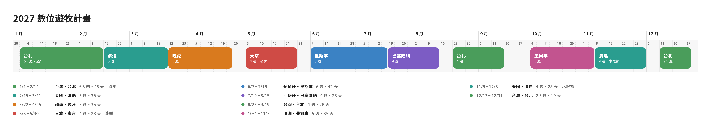

# 今天不在家工作

**A Digital Nomad Planner** — the Chinese name means "not working from home today".

[繁體中文](README.md) · **English**

A single-page planner for a year of digital nomading. The year is laid out as 53 weeks; drag across them to block out which city you'll be in and when. Your data stays in your browser — no account, no backend.

**Live: <https://simonlin7972.github.io/digital-nomad-planner/>**



The interface is available in Traditional Chinese and English; switch from the toolbar.

---

## Contents

- [Features](#features)
- [Getting started](#getting-started)
- [Controls](#controls)
- [Data and privacy](#data-and-privacy)
- [Data format](#data-format)
- [Project structure](#project-structure)
- [Design notes](#design-notes)
- [Known limits](#known-limits)
- [Possible next steps](#possible-next-steps)
- [Third-party resources](#third-party-resources)
- [Contributing](#contributing)
- [License](#license)

---

## Features

### Year view (timeline)

- One horizontal timeline of the 53 weeks of 2027, one cell per week, each split into two half-weeks
- Drag across empty cells → enter a country and city → a stay appears
- Dragging a whole stay **reorders** it: once it is halfway past a neighbour the two swap, and so on down the line
- Dragging a stay's edge **resizes and pushes**: growing shoves neighbours along, using up gaps first
- Holding `Alt` (`⌥` on a Mac) while dragging **duplicates**: the original stays put and a copy lands where you let go, pushing whatever is in the way
- A strip under each stay shows its country (flag and name); back-to-back stays in the same country share one strip
- Zoom from 100% to 600% with the slider, a trackpad pinch, two-finger touch, or `Ctrl`/`Alt` + wheel, always centred on the pointer
- Drag the month row to pan; click a month to open it in the month view

### Month view (calendar)

- A seven-column calendar, precise to the **day**
- Drag across days to add a stay; drag a bar's ends to change its dates; click a bar to edit it
- The header shows how many days of the month are planned and free

### What a stay records

- Country and city (at least one). Both are picked from searchable lists, in either language:
  - Countries: about 260, also searchable by ISO code or common alias (`thai`, `jp`, `韓國`)
  - Cities: about 330 common ones built in. With a country chosen only its cities are listed; picking a city with no country fills the country in. Cities not on the list can simply be typed
- Exact start and end dates
- Color (black plus 8 others; a new place starts black, a place you've used before keeps its color)
- Who you're travelling with
- Flight booked: airline, flight number, departure time, booking reference, fare
- A note

### Overview

- **Summary**: weeks planned and free, countries and cities visited, an estimate of flights and hours in the air, and weeks and days per country and city
- **Days of stay**: the summary works out the most days spent in the Schengen area within any 180 days (the limit is 90; when exceeded it says from which date), and the days planned in Taiwan during 2027 (183 days is the tax-residency threshold). Only days on the timeline are counted
- **Itinerary**: one line per stay — dates, flag and country, city, weeks (days), companions, note; filter by Q1–Q4; stays with a flight show a ticket icon; stays that overrun the Schengen limit show a warning icon
- **Free stretches**: unplanned days between stays are listed in the itinerary too; press `+` to add a stay in that gap
- **Map**: every place in visit order, joined into a route
- **Public holidays**: toggle Taiwan's and Australia's 2027 holidays, drawn over the timeline and calendar

### Also

- A built-in "How to use" guide: gestures, where data lives, backup and transfer
- Traditional Chinese and English interface, switched from the toolbar; defaults to the browser's language and remembers your choice
- A compact toolbar: undo and redo are icons; export, import and Share live in the `⋯` menu
- Undo and redo, up to 100 steps
- JSON export and import; file names carry the export date (e.g. `nomad-plan-2027_2026-10-05.json`)
- Share: preview the year as an image, then download it as a PNG (fixed size, with the timeline, country strips and flags, holidays that are switched on, ticket markers, a summary line and the itinerary; flight details left out). On a phone it can open the system share sheet
- Read-only phone layout: below 720px the page becomes view-only — now / next, one card per stay (flight details and full notes included), the summary and the map. Plan on a computer, export, then import on the phone
- Every change is saved automatically
- Backup reminder: when the plan has changed and gone 7 days without an export, a reminder appears under the header, with buttons to export or to put it off for 3 days

---

## Getting started

Requires Node.js 22 or later.

```bash
git clone https://github.com/Simonlin7972/digital-nomad-planner.git
cd digital-nomad-planner
npm install
npm run dev
```

Open http://localhost:5173.

| Command | What it does |
| --- | --- |
| `npm run dev` | Start the dev server (fixed to port 5173) |
| `npm run build` | Type-check, then bundle into `dist/` |
| `npm run preview` | Serve the built bundle locally |

The build is plain static files and can be hosted anywhere. Asset paths are relative (`base: './'` in `vite.config.ts`), so it also works from a sub-path.

There are no automated tests and no linter. The `tsc --noEmit` inside `npm run build` is the only check.

### Deploying

Pushing to `main` builds and publishes to GitHub Pages through GitHub Actions (`.github/workflows/deploy.yml`). To deploy a fork, go to the repository's Settings → Pages and set Source to **GitHub Actions**.

The live site and a local copy use separate browser storage (different addresses), so they don't share data. Use export and import to move a plan between them.

---

## Controls

### Mouse and touch

| Action | Year view | Month view |
| --- | --- | --- |
| Drag across empty space | Select in half-weeks; add a stay | Select in days; add a stay |
| Click a stay | Open the editor | Open the editor |
| Drag a stay | Reorder | — (not supported) |
| `Alt` + drag a stay | Drop a copy where you let go | — (not supported) |
| Drag a stay's edge | Resize, pushing neighbours | Resize, pushing neighbours |
| Hover a stay | Show its details | Show its details |
| Drag the month row | Pan the timeline | — |
| Click a month | Open that month | — |
| Pinch / `Ctrl`+wheel / `Alt`+wheel | Zoom the timeline | — |

### Keyboard

| Shortcut | Action |
| --- | --- |
| `⌘Z` / `Ctrl+Z` | Undo |
| `⌘⇧Z` / `Ctrl+Shift+Z` / `Ctrl+Y` | Redo |
| `Esc` | Close the editor |
| `Enter` (in the editor) | Save |

Undo and redo shortcuts are left alone while you are typing in a field, while the editor is open, or mid-drag.

---

## Data and privacy

**Your plan is never uploaded to a server.** Everything is kept in the browser's `localStorage`:

| Key | Contents |
| --- | --- |
| `dnp-plan-2027` | The plan itself |
| `dnp-geocode` | Cached coordinates for place names |
| `dnp-zoom` | Timeline zoom level |
| `dnp-view` | Current view (year or month) and month |
| `dnp-holidays` | Which holiday sets are on |
| `dnp-lang` | Interface language |
| `dnp-backup` | Time of the last export (or import) and a fingerprint of the plan, used to decide when to show the backup reminder |

Clearing browser data, or using a different browser or computer, means the plan won't be there. Use Export (in the `⋯` menu) to keep a backup.

The page talks to four outside services:

| Service | What is sent | Why |
| --- | --- | --- |
| [Nominatim](https://nominatim.openstreetmap.org/) (OpenStreetMap) | The "city, country" text for each place | To find coordinates for the map and the flight estimate. Each place is looked up once |
| [OpenFreeMap](https://openfreemap.org/) | Map tile requests | The base map |
| [emfont](https://font.emtech.cc/) | Font file requests | The interface typeface |
| [Google Fonts](https://fonts.google.com/) | Font file requests | The pixel typeface of the English tagline under the title |

Flight details such as booking references are stored in `localStorage` and are written into exported JSON. Keep that in mind before sharing an export.

---

## Data format

An exported file:

```jsonc
{
  "year": 2027,
  "stays": [
    {
      "id": "0b7c…",              // generated on import if left out
      "country": "th",            // see below; may be empty, but not together with city
      "city": "Chiang Mai",
      "start": "2027-02-10",      // ISO date
      "end": "2027-03-07",        // inclusive; must be >= start
      "color": "teal",            // optional: black red orange yellow green teal blue purple pink
      "companions": "Amy",        // optional
      "ticket": {                 // optional; its presence means "flight booked", every field optional
        "airline": "EVA Air",
        "flightNo": "BR211",
        "departure": "2027-02-10T08:30",
        "bookingRef": "ABC123",
        "price": "NT$ 8,500"
      },
      "note": "Yi Peng festival"  // optional
    }
  ]
}
```

**Country and city are stored in a language-neutral form** and turned into names for display:

| Field | On the list | Not on the list |
| --- | --- | --- |
| `country` | Lower-case ISO code (`th`, `jp`), or a region id (`europe`, `southeast-asia`, `south-america`, …) | The text you typed, kept as is |
| `city` | The city's English name (`Chiang Mai`) | The text you typed, kept as is |

Names are accepted on import too: `"country": "泰國"`, `"Thailand"` and `"city": "清邁"` are all recognised and converted to the form above.

Imports are sanitised (`sanitize`): entries that are malformed, out of range, or that overlap an earlier entry are skipped rather than failing the whole file.

Dates can range from 2026-12-28 to 2028-01-02, the 53 full weeks that cover 2027.

Older formats still load: week-based `startWeek`/`endWeek`, a single `location` field (treated as the city), and countries and cities stored by name rather than code.

---

## Project structure

```
index.html              Entry page; loads the font and favicon
public/favicon.svg      16×16 pixel-art globe
docs/overview.png       Sample image for the README (downloaded from the app's Share dialog)
src/
  main.tsx              React mount point; sets the stylesheet order
  App.tsx               Wires the pieces together; owns the plan and page-level state
  components/           UI components, each with its stylesheet (.css) beside it
    Toolbar             Header actions and the ⋯ menu (export, import, share)
    ViewBar             Year/month switch, holiday toggles, zoom
    YearView            The year timeline, including drag, resize and copy handling
    MonthView           The month calendar
    Summary             Summary panel (including Schengen and Taiwan day counts)
    StayList            Itinerary, free-stretch rows and quarter filter
    BackupReminder      Backup reminder under the header
    Editor              Dialog for adding and editing a stay
    HelpDialog          The "How to use" guide
    ShareDialog         Share: PNG preview, download, system share sheet
    MobileItinerary     The read-only phone itinerary (now / next, stay cards)
    HoverCards          Floating cards for stays, tickets and holidays
    Combobox            Searchable country and city pickers
    DatePicker          Custom date picker (instead of the browser's)
    MapView             Map (lazy-loaded)
    Flag                Country flag
    PixelNomad          The pixel-art animation in the header (someone on a laptop under a palm tree)
    Tagline             The typewriter tagline under the title
    Dialog.css          Shell shared by the editor and help dialogs
  hooks/
    useHistory          Undo/redo stack
    useZoom             Timeline zoom and its anchor point
    usePinchZoom        Trackpad, touch and wheel zoom gestures
    useCoords           Place coordinates, distances and the flight estimate
    useScrollLock       Stops the page scrolling behind a dialog
    useNarrow           Whether the screen is 720px or narrower (the read-only phone layout)
    useBackupReminder   Tracks time since the last export and decides whether to remind
  lib/                  Logic and data that isn't UI
    weeks.ts            Date model: weeks, day indexes, half-week slots, month ranges, labels
    storage.ts          Types, load/save, import sanitising, reorder/push/insert algorithms, colors
    prefs.ts            View, holiday toggles and zoom preferences
    stayRules.ts        Free stretches, Schengen 90/180 and Taiwan's 183 days
    backup.ts           Backup reminder state and rules
    flags.ts            Country list, search, name → ISO code
    cities.ts           Built-in city list (Chinese and English) and search
    holidays.ts         2027 public holiday data
    geocode.ts          Nominatim lookups, rate limiting, cache
    exportPng.ts        Draws the PNG on a canvas
    files.ts            File names and download
    util.ts             Small helpers
    i18n.tsx            Dictionaries, current locale, `t()`
  styles/base.css       Design tokens, page background, shared buttons and panels
README.md               Chinese README
README.en.md            This file; kept in step with README.md
MVP.md                  Product spec and decision log (Chinese)
CLAUDE.md               Project notes for Claude Code
.claude/                Claude Code settings: preview launch, docs-sync hook
.github/workflows/      Deploys to GitHub Pages on push to main
```

Built with Vite, React 19 and TypeScript. There is no router, state library, UI framework, CSS preprocessor or drag-and-drop library; interactions use native pointer events and the styles are plain CSS.

---

## Design notes

Knowing these before reading the code will save time.

**Dates are day indexes.** Day 0 is 2026-12-28, the Monday of the week containing 1 January 2027. In memory a stay is `{ startDay, endDay }`, inclusive; it becomes ISO strings only when saved. Because day 0 is a Monday, `day % 7` is the weekday.

**The year view is approximate; the data is always exact.** The timeline splits each week into two half-week slots (Monday–Thursday, Friday–Sunday). Each end of a stay is drawn at the nearest slot boundary, but the stored dates don't change. So a stay moved to start on a Wednesday in the month view still draws from Monday or Friday in the year view.

**Dragging, resizing and copying each have their own rule.** Dragging a whole stay calls `reorderStays` (list-style reordering, passing over neighbours); dragging an edge calls `pushStays` (order preserved, neighbours shoved along); `Alt`-dragging calls `insertStay` (drop a new stay in and push what's in the way to either side, or all one way if the other has no room). All three are pure functions, recomputed from the original data on every pointer move, so no state accumulates and dragging back to the start always restores the plan.

**Stays never overlap.** You can only be in one place on a given day. Every path that changes the plan — creating, editing, dragging, importing — keeps that true.

**Every change to the plan goes through one `setStays`.** It comes from `useHistory` and pushes the previous state onto the undo stack, so a new feature that uses it gets undo for free. Only `App.tsx` holds the plan; the year and month views manage their own drag state and report the result through callbacks.

**The country list isn't hard-coded, and stays store codes.** `lib/flags.ts` builds about 260 countries, in Chinese and English, from the browser's `Intl.DisplayNames`, then adds a few regions (Europe, Southeast Asia, South America, …) and common aliases. A stay stores an ISO code or region id and is given a name in the current language only when shown, so switching language needs no data change. The field still accepts text that isn't on the list (for older data and unusual cases); that is stored as typed and flagged as not being on the list.

**The city list is hand-written.** `lib/cities.ts` holds about 330 cities people commonly base themselves in, with Chinese and English names. It isn't a gazetteer and has no coordinates. Listed cities are stored by English name and shown in the current language; anything else is stored as typed, with no warning. To add a city, add a `['中文', 'English']` pair under its country code in that file.

**The translation layer is small.** `lib/i18n.tsx` is two dictionaries and a `t(key, vars)` function. The current locale lives in a module variable outside React, so plain functions such as the date formatters and the PNG export can read it; a component calls `useLocale()` once to re-render when the language changes. The "How to use" guide is prose, so each language is written out whole rather than assembled from dictionary strings.

**Flight time is an estimate.** It takes the straight-line distance between consecutive stays, at 850 km/h plus half an hour per flight; hops under 300 km count as ground travel. Layovers are ignored, as are the trips from and back to home.

**Day-count rules are pure calculation over what is on the timeline.** `lib/stayRules.ts` identifies Schengen countries by ISO code (the 29 full members as of 2025; not open-border microstates such as Monaco, nor regions such as "Europe") and, for each day spent in Schengen, counts back 180 days. The timeline starts on 2026-12-28; earlier days are treated as outside Schengen. For Taiwan only stays planned there between 1 January and 31 December count; unplanned days don't, even if you would be at home. The results are a prompt to check, and the official rules of each country are what apply.

**The backup reminder isn't part of the plan.** `dnp-backup` remembers a fingerprint of the plan at the last export or import (an FNV-1a hash of the export format, independent of stay order). The clock starts when the plan differs from that fingerprint and the reminder shows after 7 days; undoing back to the exported state stops it. It isn't in the undo history and isn't written to exports.

**The PNG is drawn separately.** `lib/exportPng.ts` redraws the year on a canvas rather than capturing the screen, so the output has a fixed size regardless of window and zoom — but new on-screen elements don't appear in it unless they are added there too.

---

## Known limits

- **The year is fixed at 2027.** The constant is `YEAR` in `lib/weeks.ts`; the holiday data is also for 2027 only
- **Two interface languages**, Traditional Chinese and English; the product spec (`MVP.md`) is in Chinese only
- **What you type isn't translated**: unlisted countries and cities, notes and companions show as typed in both languages
- **Editing is desktop-only.** Phones (720px and narrower) get a read-only layout; a tablet or laptop window narrower than 720px does too
- **No automated tests**
- **The month view can't move a whole stay or `Alt`-drag a copy**; drag the ends or change the dates in the editor
- **A copied stay doesn't carry the flight details** (a flight belongs to one trip)
- **One flight per stay**
- **The shared image doesn't include the map**
- **Place names on the map are in the local script and English**, as the base map provides
- **The built-in city list is limited** (about 330); smaller places have to be typed, and the Chinese names are hand-picked and may differ from the spelling you're used to
- **Place lookup depends on Nominatim.** Places it can't find don't appear on the map and are left out of the flight estimate
- **The typefaces depend on the emfont and Google Fonts services**; offline, the page falls back to system fonts
- **Australian holidays are national ones only**; state holidays aren't listed
- **Undo history doesn't survive a reload**
- **Day counts are estimates**: they know nothing of travel before 2026-12-28 or of actual entry and exit days, and a day on which you change places counts toward only one stay
- **The Schengen country list is hard-coded** and needs a manual update when membership changes

---

## Possible next steps

Not scheduled; discussion welcome.

- Selectable year, multiple years
- More languages
- A real city database with search, instead of a short list plus free text
- A seasonal layer: best and worst months per place (for example Chiang Mai's lantern festival in November and its haze in February and March)
- Visa day rules for other countries (only Schengen 90/180 so far)
- Dragging whole stays in the month view
- Several flights per stay, accommodation, budget
- Optional cloud sync

The full product spec and decision history are in [MVP.md](MVP.md) (Chinese).

---

## Third-party resources

| Resource | Used for | License / terms |
| --- | --- | --- |
| [React](https://react.dev/) | UI | MIT |
| [Vite](https://vite.dev/) | Development and bundling | MIT |
| [MapLibre GL JS](https://maplibre.org/) | Map engine | BSD-3-Clause |
| [OpenFreeMap](https://openfreemap.org/) | Map tiles (Positron style) | See the site; data © OpenStreetMap contributors |
| [Nominatim](https://nominatim.org/) | Place names to coordinates | Subject to its [usage policy](https://operations.osmfoundation.org/policies/nominatim/) |
| [Phosphor Icons](https://phosphoricons.com/) | Icons | MIT |
| [flag-icons](https://github.com/lipis/flag-icons) | Flags | MIT |
| [975HazyGo](https://font.emtech.cc/fonts/975HazyGo) (via emfont) | Interface typeface | See the license shown on the font's page |
| [Pixelify Sans](https://fonts.google.com/specimen/Pixelify+Sans) (via Google Fonts) | Tagline typeface | OFL-1.1 |

The 2027 holiday data was compiled by hand. Taiwan's long weekends follow press reports of the government's 2027 office calendar; the Dragon Boat Festival, Mid-Autumn Festival and Teachers' Day are single days worked out from the calendar. Australia lists national holidays only. None of the dates were checked one by one against the original official notices, so treat the official sources as authoritative.

If you deploy this publicly with real traffic, note that Nominatim's public server allows one request per second and isn't meant for heavy use; switch to a self-hosted or paid geocoder.

---

## Contributing

Issues and pull requests are welcome.

- Make sure `npm run build` passes first
- Change the plan only through `setStays` in `App.tsx`, so undo keeps working
- Put logic that moves stays in the pure functions in `lib/storage.ts`, and keep stays from overlapping
- New components go in `src/components/`, with styles in a `.css` file of the same name imported by that component; only things several components share go in `styles/base.css`
- Anything new that talks to the network must be described under [Data and privacy](#data-and-privacy)
- All interface text goes in the dictionaries in `src/lib/i18n.tsx`, in both languages; don't hard-code strings in components
- When behaviour changes, update `README.md`, this file and `MVP.md` (and `CLAUDE.md` when a convention changes). When developing with Claude Code, `.claude/hooks/docs-check.sh` checks for this before a session ends

---

## License

[MIT](LICENSE) © 2026 Simon Lin

Third-party resources are under their own licenses; see [Third-party resources](#third-party-resources).
